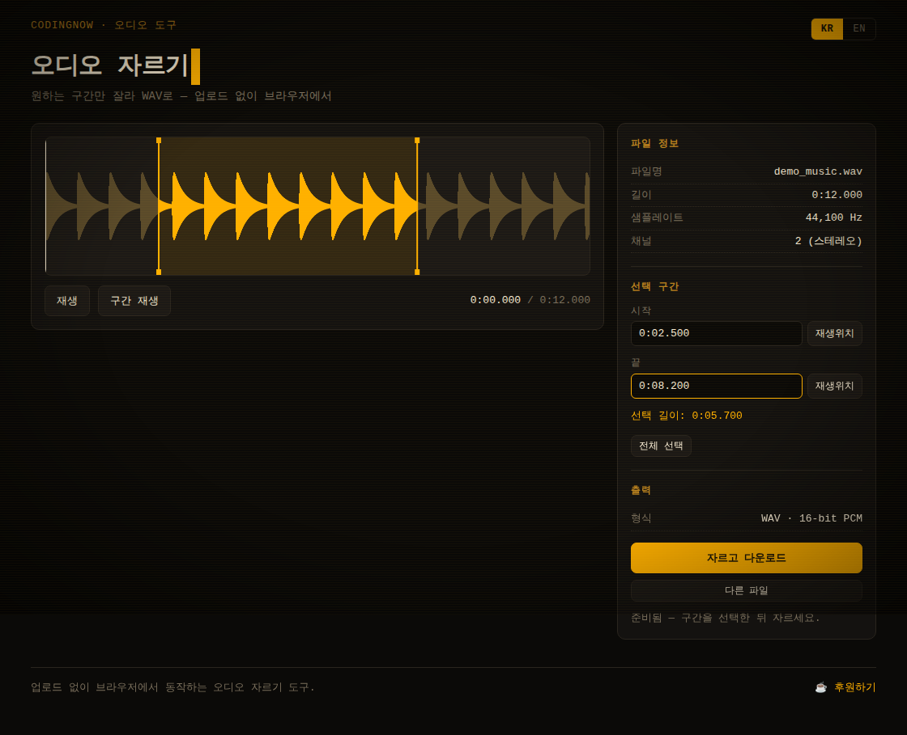

홈페이지 : https://www.coding-now.com/audio-cutter

# 오디오 자르기 (Audio Cutter)

원하는 구간만 잘라 무손실 **WAV**로 저장하는 단일 HTML 도구입니다.
**파일은 서버로 전송되지 않고, 모든 처리는 브라우저 안에서** 이루어집니다. 외부 라이브러리도 사용하지 않습니다.

---

## ✨ 특징

- **단일 `.html` 파일** — 빌드 도구·서버·프레임워크 없이 `index.html` 하나로 완결.
- **업로드 없음** — Web Audio API로 브라우저 안에서 디코딩·자르기·저장. 인터넷 없이도 동작.
- **외부 라이브러리 없음** — 브라우저 내장 API만 사용 (폰트만 Google Fonts).
- **진짜 자르기** — 선택 구간을 직접 16-bit PCM WAV로 재인코딩 (가짜 아님).
- **파형 편집** — 핸들 드래그·구간 드로잉·시간 직접 입력으로 구간 선택, 미리듣기 지원.
- **KR/EN 전환** — 새로고침 없이 즉시 전환, 선택은 `localStorage`에 저장.
- **앰버 CRT 터미널 테마** — 반응형(데스크탑 2단 / 모바일 1단).

## 🚀 사용법

1. `index.html`을 브라우저로 엽니다. (별도 설치·서버 불필요)
2. 오디오 파일을 **끌어다 놓거나** 클릭해서 선택합니다. (`MP3 · WAV · M4A · OGG · FLAC` 등)
3. 파형에서 **시작·끝 핸들을 드래그**해 자를 구간을 정합니다.
   - 파형을 클릭하면 그 지점으로 재생 위치가 이동하고, `재생위치` 버튼으로 시작/끝을 지정할 수 있습니다.
   - `구간 재생`으로 자르기 전에 미리 들어볼 수 있습니다.
4. **자르고 다운로드**를 누르면 선택 구간이 `원본이름_cut.wav`로 저장됩니다.

자세한 설명과 FAQ는 **[사용법 가이드](docs/usage-guide.md)** 를 참고하세요.

## 🎬 데모

가짜 커서가 사용 흐름을 시연하는 자동 재생 워크스루입니다. (자막·KR/EN 전환 포함)

- 한국어: [`docs/demo_kr.html`](docs/demo_kr.html)
- English: [`docs/demo_en.html`](docs/demo_en.html)

## ❓ 왜 MP3가 아니라 WAV인가요?

브라우저에는 내장 MP3 인코더가 없고, 이 도구는 **외부 라이브러리를 쓰지 않는다**는 원칙을 지킵니다.
그래서 추가 의존성 없이 항상 동작하는 **무손실 WAV**로 내보냅니다. MP3가 필요하면 저장한 WAV를 별도 변환 도구로 바꾸면 됩니다.

## 🛠 기술

- **디코딩**: `AudioContext.decodeAudioData` — 브라우저가 지원하는 오디오 형식을 PCM으로 디코드.
- **파형**: `<canvas>`에 채널 피크를 그려 표시, 선택 구간 강조 + 플레이헤드.
- **저장**: 선택 구간 샘플을 직접 RIFF/WAVE 헤더와 함께 작성해 16-bit PCM `Blob`으로 다운로드.

---

## English

A single-file, in-browser **audio cutter**. Load an audio file, drag the start/end
handles on the waveform to choose a region, preview it, then **Cut & download** to
save the selection as a lossless 16-bit PCM **WAV**.

- No upload — everything runs in your browser, no external libraries.
- Input: any format your browser can decode (MP3, WAV, M4A, OGG, FLAC, …).
- Output is WAV because browsers ship no built-in MP3 encoder; convert the WAV afterward if you need MP3.
- Just open `index.html`. See the [usage guide](docs/usage-guide.md) or the
  [demo](docs/demo_en.html).

---

☕ 후원하기 / Support: https://paypal.me/codingnow · CODINGNOW
